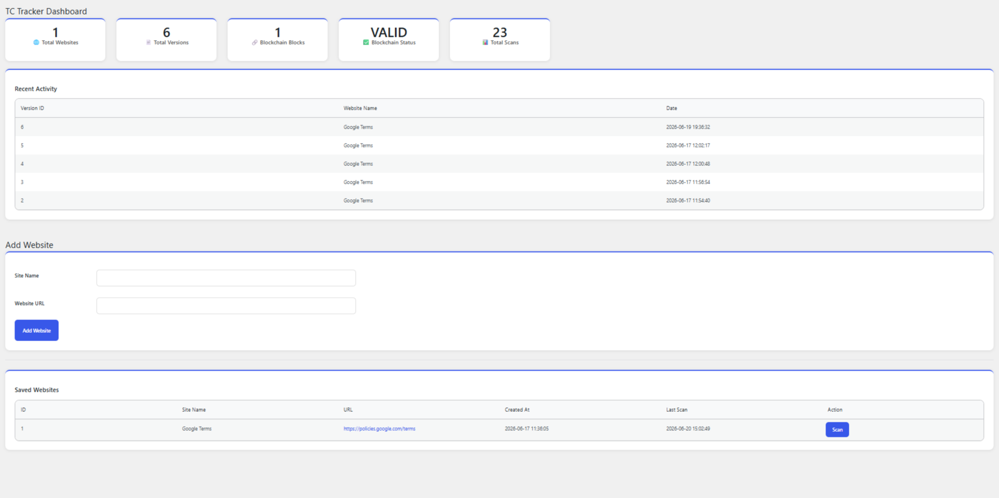
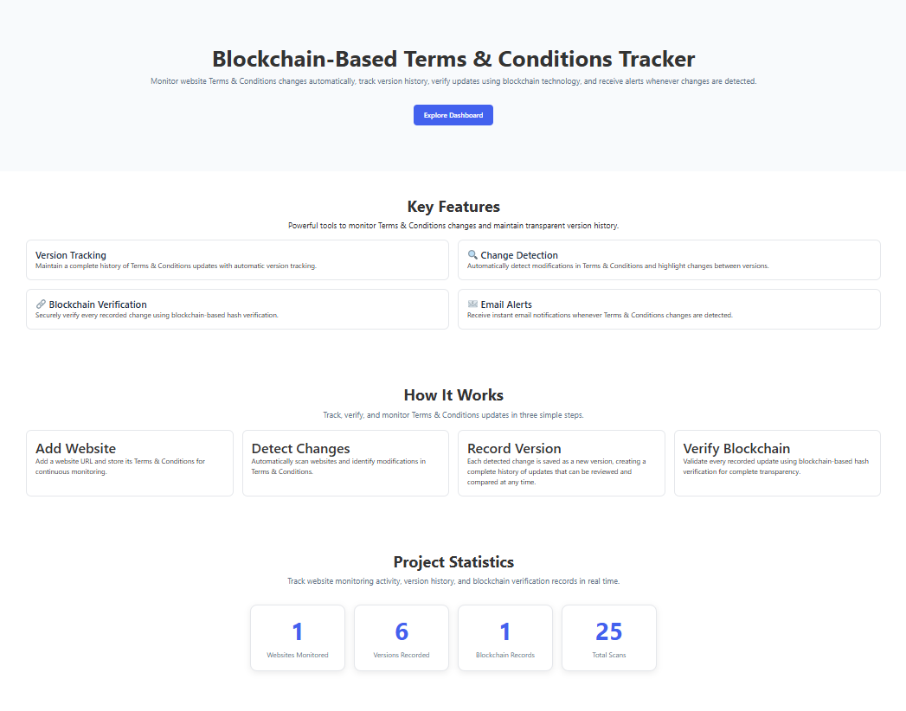
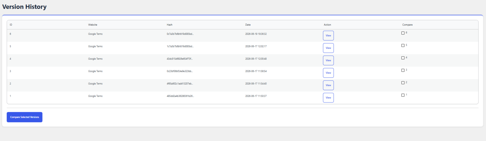
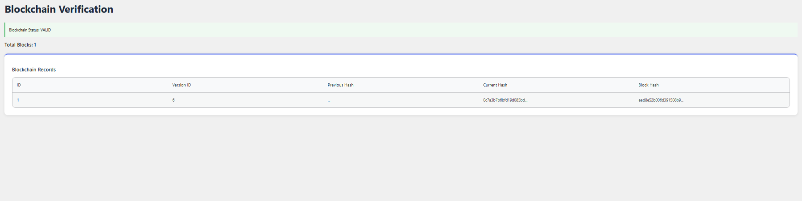
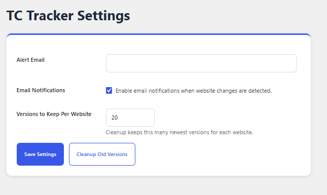

# TC Tracker

Blockchain-Based Terms & Conditions Monitoring Plugin for WordPress

## Overview

TC Tracker is a WordPress plugin that automatically monitors website Terms & Conditions pages, detects modifications, stores version history, and verifies updates using blockchain-inspired hash verification.

The plugin helps maintain transparency by preserving historical versions of Terms & Conditions documents and providing tamper-evident verification of recorded changes.

This project is currently running in a local WordPress development environment.

---

## Features

* Website Monitoring
* Automatic Terms & Conditions Change Detection
* Version History Tracking
* Blockchain-Based Verification
* SHA-256 Hash Generation
* Email Alert Notifications
* WordPress Admin Dashboard
* Scan Statistics and Monitoring

---

## Technology Stack

### Frontend

* HTML
* CSS
* JavaScript
* Elementor

### Backend

* PHP
* WordPress Plugin Development

### Database

* MySQL

### Security & Verification

* SHA-256 Hashing
* Blockchain-Inspired Record Verification

---

## Database Tables

* wp_tct_sites
* wp_tct_versions
* wp_tct_blockchain

---

## Screenshots

---

## Installation

1. Download the plugin source code.
2. Place tc-tracker.php inside the WordPress plugins directory.
3. Activate the plugin from the WordPress Admin Dashboard.
4. Configure monitored websites.
5. Run scans and track Terms & Conditions changes.

---

## Future Enhancements

* Multi-user support
* Advanced comparison view
* Scheduled cloud monitoring
* Enhanced blockchain verification
* Analytics dashboard

---

## Author

Kunal Sharma
